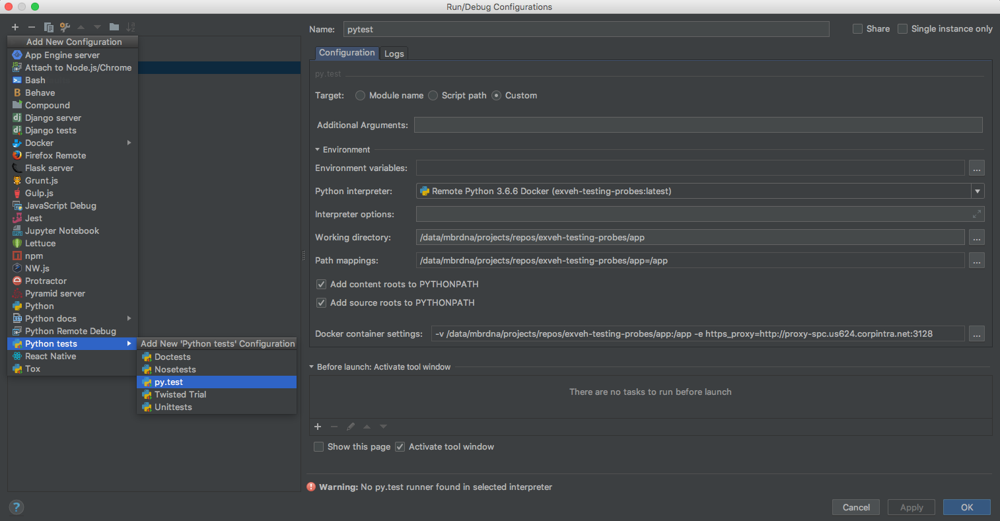

# This is the base sceleton for a Python Flask app

To use this sceleton, just 
* fork this repo
* clone this repo
* remove the parts not needed

## Prerequisites:

* docker is installed 

## Steps to run the app locally:

1. Build the container locally: `docker build -t my-flask-app .`
2. Run the container locally: `docker run -it --rm -p 80:80 --name my-flask-app -v $(pwd)/app:/app my-flask-app`
3. Access the app via your browser: [http://localhost](http://localhost)


## Testing:

`pytest` is ran from within the `/app` directory inside the container on build. The container build will not be successful if a test fails. 
For the test to be successful the build has to happen within Daimler's internal network and with the certificate in the `/app` directory.

The following screenshot helps to configure testing in pycharm:


<p align="center">
  
</p>

## Api Documentation:

<details><summary><b>Sample API request: </b><code>GET /api/&#60;string:variable&#62;</code></summary>
<p>

This an endpoint of the api.

**Endpoint**: `GET /api/<string:variable>`

**Return constraints:**

```json
{
    "name": String, 
    "data": {
        "age": Int,
        "height": String
    }
}
```

**Return example:**

```json
{
    "name": "jonnylangefeld", 
    "data": {
        "age": 27,
        "height": "6 ft 5.5"
}
```

</p>
</details>